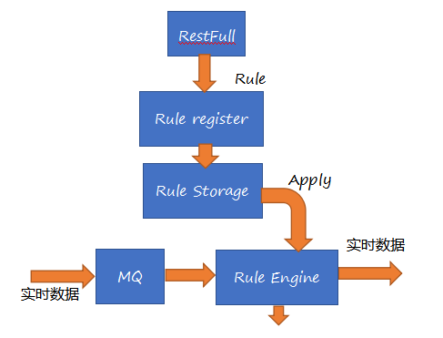
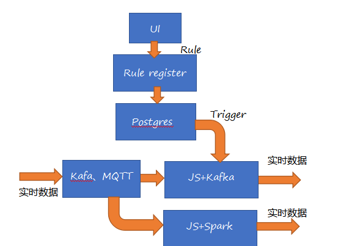

 
## 一、背景
	规则引擎是一种根据规则中包含的指定条件，判断其能否匹配运行时刻的实时条件来执行规则中所规定的动作，
	用户可通过规则引擎设定消息处理规则，
	对指定的消息采取相应的措施来对设备进行监控和处理，如发送警告信息；
    也可以将设备消息转发， 或者过滤到其他部件。

#### 1.1 基本概念
		1)规则
		规则包含一个条件过滤器和多个动作。一个条件过滤器可以包含多个过滤条件。条件过滤器是多个布尔表达式的组合，其组合结果仍然是一个布尔类型的。
		在程序运行时，动作将会在条件过滤器值为真的情况下执行。
		2）动作
		动作是一段可执性的代码。
		3）消息队列
		消息队列是规则应用的主体， 消息队列中包含的消息具有各种属性。 这些属性出现在规则过滤条件中， 用于判断某条消息是否满足条件。 
#### 1.2 典型的应用场景包括： 
	 1.实时告警异常的数据；
	 2.计算一天内的温度最大最小和均值等；
	 3.将满足某条件的的数据转存以便查询；
	 4.过滤异常数据等。

## 二、架构
#### 2.1 逻辑模块：

#### 2.2 实现架构：

## 三、 规则描述
#### 3.1 规则BNFC
	Rule :=  if Conditions then Actions

	Conditions := Conditions and Condition |
                  Conditions or Condition | 
				  Condition

	Condition :=  Key Operator Value
		Key := Key name string | 
               Function（Key name string）

	   Function（Key name string） : = Window Function 
	   WindowFunction := (day|hour| minute|second) (key, (min|max|mean|var))
	
	Operator:= Basic Operator | Advanced Operator
	
	Basic  Operator:=   > | < | = | >= | <= |<> 
	Advanced Operator := ℗ |SelfDef
	
	Value: = Static value | Key |Function| Expression(key) | Model 
	
	Actions:= Alarm | Filter | SelfDef

#### 3.2 规则约束
	1.℗只能跟Model名
	2.Expression（key） 中只能有1个Key， 其他参数都是常量
	3.SelfDef action是可执性的代码段（java， Scala， python）

## 四、Rule Engine Demo说明
  - [规则定义详细定义](data/doc/规则定义.docx)
- Step 1： Rule 定义 
    
		{
		  "name": "in-press-alarm",
		  "weight": 0,
		  "dataSource": {
		    "type": "kafka",
			"configuration": {
				"topic": "Suct_Data",
				"format": "null",
		        "keys": [
		         "Suct_Pres_Status"
		        ]
		    }
		  },
		  "filters": [
		    {
		      "name": "吸气压力状态",
		      "type": "kafkaWindow",
			  "configuration": {
			  "size":2000,
			  "step":1000
			  },
		      "condition": "Sum(Suct_Pres_Status) > 70"
		    }
		  ],
		  "actions": [
		    {
		      "type": "Print",
		      "template": "吸气温度高"
		    }
		  ]
		}
- Step 2： Rule注册

		curl -X POST -H 'Content-Type: application/json' -d @Rule.json @localhost:8080/api/rule
- Step 3： Rule 启动

		首先Kafka 发送数据到Topic Suct_Data
		curl -X POST @localhost:8080/api/rule/ID/activate
- Step 4.   结果查验

		通过控制台来查看运行结果